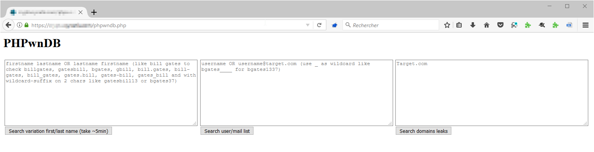
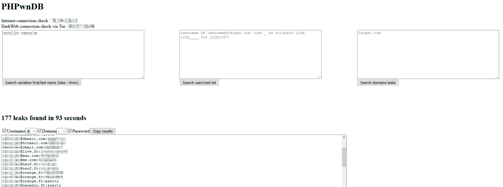

# 💡 phpwndb : search credentials leaked on pwndb database with variation

PHPwnDB is an adaptation of tools like [pwndb.py](https://github.com/davidtavarez/pwndb) in PHP for using it simply via a web browser.
PHPwnDB permits search based on `domain.tld`, `username`, `firstname lastname` permutations and the use of **wildcard**.
Results can be filtered to produce instant wordlists *read-to-use* through hashs cracker tools or Burp Intruder.

PHPwnDB can be very usefull during security assessments or Bug Bounty, when *firstname lastname* or *email* of the web-developer / maintainer / webmaster / author of the web application is discovered in footer, CSS file or HTML comment. By providing this information to PHPwnDB, a list of potential credentials already leaked by the past can be quickly tested against the web-app.

## 🔍 How it works?

PHPwnDB use `tor` to interact with `http://pwndb2am4tzkvold.onion`. So before use PHPwnDB, the **Tor** service must be running as a local proxy (default: `socks5h://127.0.0.1:9050`).

PHPwnDB allows an auditor to:

- Search credentials from a `domain.tld` to retrieve leaks matching emails like `xxx@domain.tld`;
- Search credentials from a specific login or email, like `bill.gates` or `bgates@microsoft.com`;
- Search credentials from a specific identity (firstname + lastname), by computing permutation, login generation and others combinations.

Wildcard can be used like: `_` to indicate any character. So it possible to make search like: 
- `bill_gates` to find `bill.gates, bill-gates, bill0gates, etc.`;
- `bgates_, bgates__, bgates___` to find `bgates0, bgates10, bgates999, bgatesadm, etc.`

The search based on firstname + lastname sanitizes the diacritics and all character not allowed in a potential email-address, then compute several combinations like:
- `FirstnameLastname`;
- `LastnameFirstname`;
- `FLastname`;
- `LFirstname`;
- `LastnameF`;
- `FirstnameL`;
- `F_Lastname` (wildcard `_` included);
- `L_Firstname` (wildcard `_` included);
- `Lastname_F` (wildcard `_` included);
- `Firstname_L` (wildcard `_` included);
- `Firstname_Lastname` (wildcard `_` included);
- `Lastname_Firstname` (wildcard `_` included);
- All the previous combinaisons with additional wildcard `_` at the end;
- All the previous combinaisons with two additionals wildcards `__` at the end.

All results of PHPwnDB are displayed in a textarea which can be easily filtered to:
- Display only **logins** (part before any `@`);
- Display only **domains** (part after any `@`);
- Display only **passwords** leaked (part after `:`);
- Or any combination of these filter, which permit a quick generation of a wordlist `username:password` or `username@domain.tld:password` or `username` or `username@domain.tld` or `password` to use it through `hashcat` or the **Burp Intruder** during web security assessments.

## 🔨 Installation

```
## With a standard Kali Linux, tor is already installed. If not:
# sudo apt-get install tor
## Then run tor in a separated shell / service:
tor & # or through a new screen command
## once tor is started, the service listens on 127.0.0.1:9050
## Be sure you have Apache + PHP7 + Curl
# apt install libapache2-mod-php php-curl
# phpenmod curl
# service apache2 restart
## deploy PHPwnDB into Apache/PHP document root
cd /var/www/html/
git clone https://github.com/yanncam/phpwndb/
```

Then, just browse `http://[SERVER]/phpwndb/phpwndb.php`.



## 🔥 Demonstration / Example / How to use?

Simply use one of the three textareas available to search `domain.tld` based, `username` based or `firstname + lastname` permutations based :



Results in the last textarea can be dynamicaly *on-the-fly* filtered and copied.

## 🧰 To go deeper...

PHPwnDB needs **Tor** deployed locally to access `http://pwndb2am4tzkvold.onion`. The PHP script proxies his request through the Tor proxy listening on `127.0.0.1:9050` by default.

DNS resolution of the domain `pwndb2am4tzkvold.onion` needs to be done through the Tor network to work. 

So, the PHP script use the **Curl** PHP library with the `CURLOPT_PROXYTYPE` define to `CURLPROXY_SOCKS5_HOSTNAME` (7). 

Plus, the scheme to reference the proxy target is explicitly defined to `socks5h://127.0.0.1:9050`. The `h` at the end of `sock5h` is needed to delegate DNS resolution to the proxy (Tor) itself (need PHP 7 at least with recent Curl module).

The `pwndb2am4tzkvold.onion` domain seems to be regularly unavailable for long periods (several days or even 1-2 weeks) within the same year (observation made over the last 2-3 years). As a result, PHPwnDB may not be functional during these down-times.

Original PwnDB service is a simple web-page hosted on `pwndb2am4tzkvold.onion` to request via SQL a simple MySQL/MariaDB database, with **result limited to 1000**. Through PHPwnDB and the *firstname + lastname* search, many requests are realized for all permutation (more time needed), so results can be larger more than 1000.

## 🍻 Credits

- GreetZ to all the Le££e team :)
